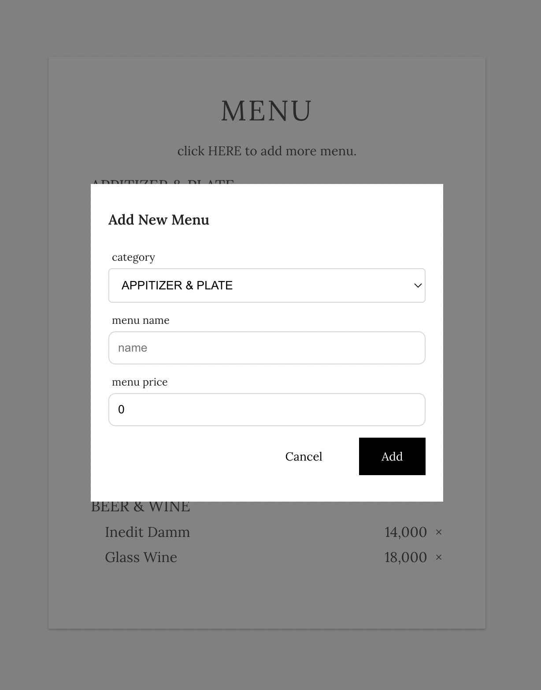
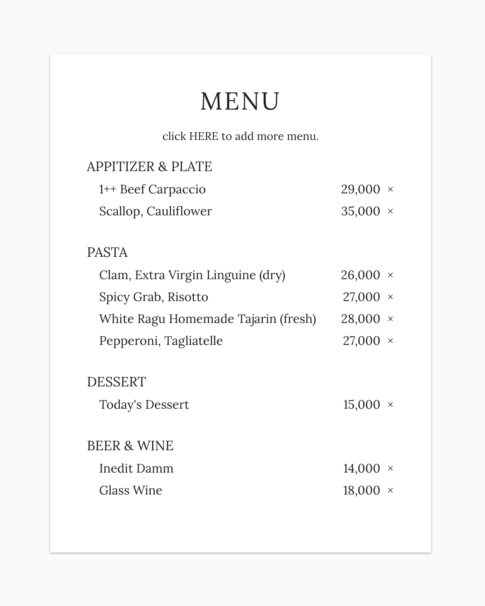

# CRD with React-Query 
{: width="400"}
{: width="400}

React Query를 사용해서 간단하게 Create, Read, Delete operation을 구현해 봤습니다.

## Example
https://react-query-3h485oh2t-kauthenticity.vercel.app/
위에서 확인해 볼 수 있습니다.
